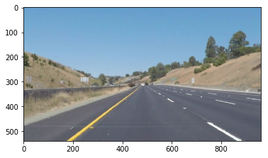
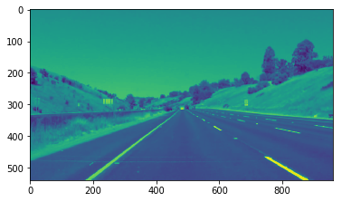
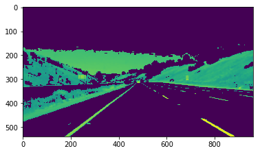
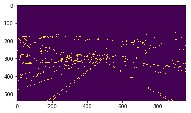
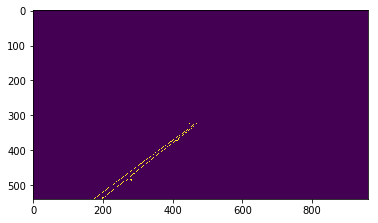
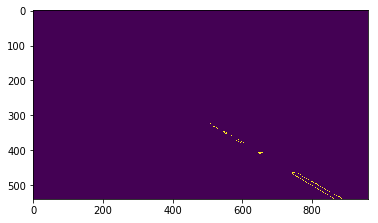
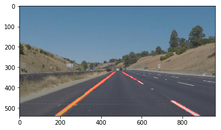
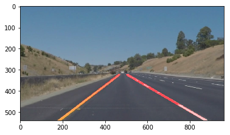

# **Finding Lane Lines on the Road** 

---

**Finding Lane Lines on the Road**

The goals / steps of this project are the following:
* Make a pipeline that finds lane lines on the road
* Reflect on your work in a written report

More complete instructions are given in the [Project Instructions](./project_instructions.md).

---

### Reflection

### 1. Image Processing Pipeline

My pipeline consists of the following steps

1. Gaussian Blurring
2. Converting to Grayscale
3. Color Thresholding
4. Canny Edge Detection
5. Region Masking
6. Hough Transformation
7. Average and Extrapolate Line Predictions

#### Gaussian Blur

The first step in my pipeline is to use Gaussing blurring on the original image. A small amount of blurring will help in suppressing any noise or large gradients that may have been present in the original image.

#### Convert to Grayscale

The next step in my pipeline is to convert the image to grayscale. This will help with accentuating any brightness gradients which is what I'm going to target to differentiate the lane lines from the road. It will also make the brightness thresholding in the next step simpler as it does not have to try to differentiate between yellow and white lane lines.

*(Note: I use the parameter cv2.COLOR_RGB2GRAY but the resulting image appears to be a collection of blues and greens rather than a gray image. Regardless the darkness gradients are still accentuated.)*
        

        
#### Brightness Thresholding

After converting to grayscale I use thresholding to remove the darker areas of the image. This will provide even greater brightness gradients than the conversion to gray scale and remove any gradients that existed in the darker regions of the image. This will be important in the next step where the edge detection method will be scanning for these brightness gradients.
        

        
#### Canny Edge Detection

The image is now prepared for Canny edge detection. This step will predict the presence of edges from brightness gradients. This will give a rather clear indication of where the lane lines are but will also include gradients through out the rest of the image that we can at this point consider extraneous. These extraneous edges will be handled in the next step of the pipeline.
        
 
        
#### Region Masking

The Canny edge detection from the previous step highlighted the edges of the lane but also found many other edges in the image. Since we know generally where the lanes should be located in the image we can mask out all of the other portions of the image. This method can also be used to differentiate between the right and left lanes which will be useful when collecting points from the Hough transform to create averaged and extrapolated lines for each lane line.

#### Hough Transform

This next step will determine where the software thinks that lines exist from the collection of points remaining in the image. Since essentially all remaining points are associated with the lane lines, the transform will provide the software's prediction of where it thinks the lanes are located.
        

        
#### Average and Extrapolate

To average and extrapolate the results of the Hough transform, I use a least squares linear regression on the points that the Hough transform decided were associated with the lane lines. The points were collected depending on whether or not they belong to the left or right lane from the region masking performed two steps back and so the two collections of points will not interfere with the linear regression of the other. The linear regression provides the linear equation of best fit for the lane lines. In order to extrapolate the lines along the predicted location of the lanes, the pipeline takes a y-coordinate at the bottom of the image and a y-coordinate that corresponds to the top of the region masking. The linear equation produced from the linear regression is used to find the corresponding x-coordinates and this is the line plotted over the original image.

### 2. Shortcomings of Current Pipeline

The results of the pipeline on the challenge video are included in the notebook to highlight its shortcomings. The average and extrapolate portion of the pipeline was left off for this video as the output is significantly less informative than the output of the Hough transform step. The following are observations of where the pipeline could use improvement:

- Detecting lane lines on lighter gray pavement
    - The pipeline is designed to accentuate and detect the brightness difference between the lane lines and the gray pavement. The challenge video, however, has a portion where the pavement is a much lighter gray than the other images and there are many instances of lines being detected in the middle of the lane rather than sticking to the lane lines.
- Portions of car appearing in image
     - The camera in the challenge video does not have the hood of the car completely removed from the image. This leads to many lines being detected on the hood of the car that are not masked out using the current region of interest and therefore the lines affect the lane line predictions.
- Transition of darker pavement to lighter pavement
    - There is a transition from dark gray pavement to light gray pavement in the challenge video. Since the current pipeline is set up to detect lines by differences in brightness, this transition is strongly picked up and included in the prediction of the lane lines.
- Shadow over lane lines
    - When a shadow passes over a lane line, it reduces the brightness gradient between the line and the pavement. This results in the pipeline having trouble determining that there are edges to be detected.
- Guard rail appearing in image
    - In a portion of the challenge video a guard rail enters the masked region. Since there is a brightness difference where the barrier meets the pavement, this edge is included in the predicted lane line.

### 3. Suggest possible improvements to your pipeline

Many of the shortcomings listed above are the result of the pipeline focusing on brightness differences. One possible improvement to the pipeline would therefore be to focus on locations of white and yellow in the image rather than resorting to grayscale. This way the changes of brightness in the gray pavement would have less of an effect on the prediction of the lane line locations.

Another possible improvement would be to refine the region of interest mask. This would prevent items between the lanes from being included in the lane line predictions such as when in the challenge video the pavement transitioned from a darker gray to a lighter gray. This would also assist with setups where the hood of the car is included in the image as it should to some extent be able to be excluded from the region of interest.